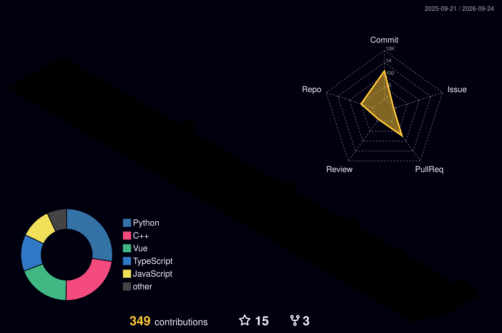

<!-- ========================= -->

<!--         HERO AREA         -->

<!-- ========================= -->

<div align="center">


<br>

<a href="https://git.io/typing-svg">
  
</a>

</div>

<br>

# Hi, I'm Yukixnya! 👋

I'm a **B.Tech Computer Science & Engineering (CSE) student at Parul University** who enjoys building things with **AI, software, and the web**.

I'm particularly interested in **AI engineering, intelligent systems, developer tools, and practical software projects**. I like taking an idea from a rough concept → **architecture → implementation → working system**.

I mainly work with **Python, C/C++, Java, and JavaScript**, while exploring **AI/ML, backend development, and modern web technologies**.

<br>


<br>

## 🛠️ Technical Stack


### Languages


### AI / Machine Learning

**RAG · Embeddings · Semantic Search · Computer Vision · NLP · LLMs · AI APIs**

### Web & Backend


### Databases & Development Tools


<br clear="both">

<br>


<br>

## ⚙️ How I Like to Build

<div align="center">

```text
┌──────────┐      ┌───────────────┐      ┌────────────────┐      ┌──────────────┐
│   IDEA   │  →   │ SYSTEM DESIGN │  →   │ DEVELOPMENT    │  →   │ WORKING      │
│          │      │               │      │ + INTEGRATION  │      │ SYSTEM       │
└──────────┘      └───────────────┘      └────────────────┘      └──────────────┘
```

</div>

I enjoy working across the stack rather than staying inside a single layer.

**Idea → System Design → Development → Integration → Optimization**

I'm especially interested in understanding **how different components work together** — from models and APIs to databases, interfaces, and the infrastructure behind them.

<br>


<br>

## 🌏 Beyond Development

Outside of programming, I'm interested in:

* **Mandarin Chinese** & learning languages
* **Japanese culture, anime, manga & donghua**
* **Guitar & EDM**
* Exploring new technologies and experimenting with ideas

<br>

<div align="center">


</div>

<br>


<br>

<!-- ========================= -->

<!--   3D CONTRIBUTION GRAPH   -->

<!-- ========================= -->

<div align="center">

### Contribution Space



</div>

<br>


<br>

## 🤝 Connect

<div align="center">

<a href="https://discord.com/users/1164680248621793300">
  
</a>

<a href="mailto:your-email@gmail.com">
  
</a>

<a href="https://www.linkedin.com/in/chandan-kumar-836806292/">
  
</a>

</div>

<br>

<div align="center">

**Open to collaborations, interesting ideas, and opportunities to build.**

</div>

<br>

<!-- ========================= -->

<!--      SNAKE ANIMATION      -->

<!-- ========================= -->

<div align="center">


</div>

<br>

<!-- ========================= -->

<!--          FOOTER           -->

<!-- ========================= -->


